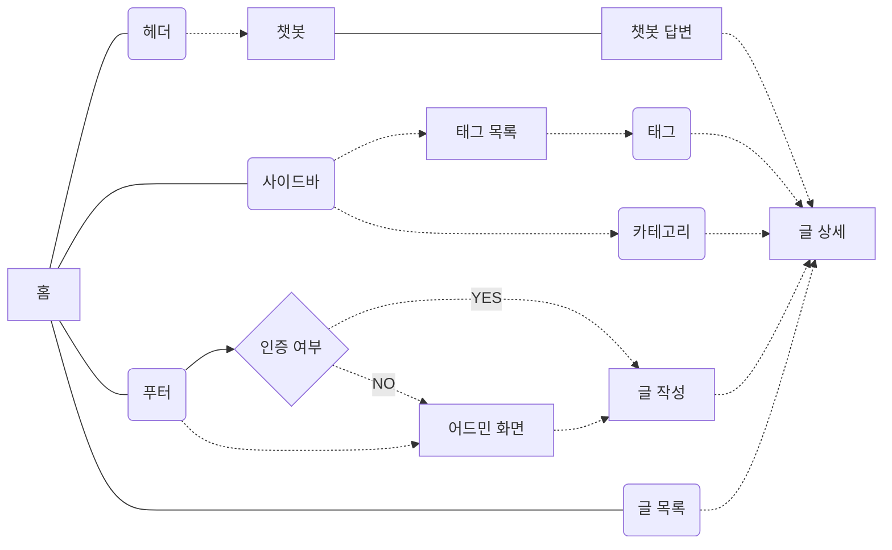

# 블로그 + 챗봇 플로우 차트

```mermaid
flowchart LR

main[홈]
header(헤더)
sidebar(사이드바)
footer(푸터)
list(글 목록)

main --- header
main --- sidebar
main --- list
main --- footer

create[글 작성]
admin[어드민 화면]
chatBot[챗봇]
chatBotResult[챗봇 답변]
detail[글 상세]

authorize{인증 여부}

tagList[태그 목록]
tag(태그)
category(카테고리)

header -.-> chatBot ---- chatBotResult -.-> detail
sidebar -.-> tagList -.-> tag -.-> detail
sidebar -.-> category -.-> detail
footer --> authorize -.->|YES| create -.-> detail
authorize -.->|NO|admin
footer -.-> admin -.-> create

list -.-> detail

```
